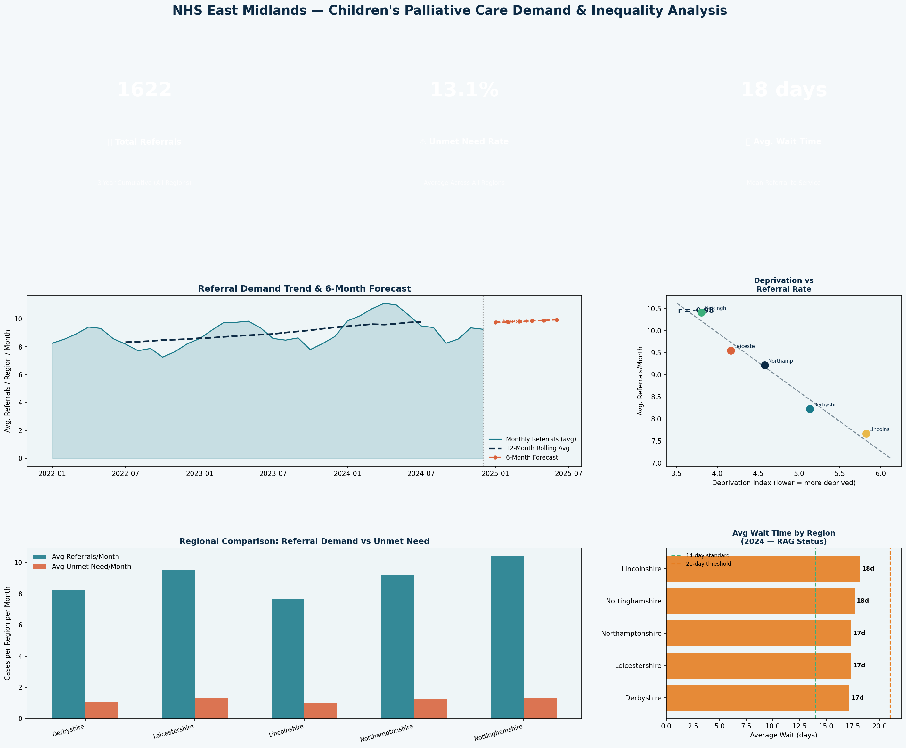

# 📈 NHS Health Inequality & Service Demand Analysis — East Midlands

> A statistical analysis of children's palliative care referral demand across East Midlands regions, examining the relationship between deprivation and healthcare need, with trend forecasting and commissioner-ready quarterly reporting — aligned with NHS dataset and statutory reporting standards.

---

## 📌 Project Overview

NHS commissioners and hospices need robust evidence to plan services, justify funding, and demonstrate impact. This project builds a statistical reporting pipeline that analyses referral demand data across five East Midlands regions, identifying health inequalities, seasonal patterns, and projected future demand — the kind of analysis that directly informs service contracts and NHSE statutory submissions.

**Key skills demonstrated:** Statistical analysis (Pearson correlation, linear regression, trend forecasting), SQL (window functions, rolling averages, RAG reporting), Python data pipeline, commissioner-ready visualisation, NHS reporting standards.

---

## 📊 Dashboard Preview



---

## 🗂️ Repository Structure

```
project3_nhs_health_analysis/
├── analysis.py          # Python statistical pipeline + visualisation
├── sql_queries.sql      # SQL schema + 5 commissioner-ready queries
├── dashboard.png        # Output dashboard
└── README.md
```

---

## 🔑 Key Findings

| Metric | Result |
|--------|--------|
| Deprivation–referral correlation | **r = −0.985** (p < 0.01) — strong relationship |
| Interpretation | More deprived regions show significantly higher palliative care referral rates |
| Highest need region | **Nottinghamshire** |
| Longest waits | **Lincolnshire** — flagged RED in Q4 2024 (23.7 day avg) |
| Projected demand (6 months) | **+5.2% increase** vs 2024 average |
| Average unmet need rate | **~13%** of estimated population need unserved |
| All regions | AMBER RAG on wait times — below 14-day standard |

---

## 🛠️ Technical Approach

### Statistical Methods (`analysis.py`)

| Method | Application |
|--------|-------------|
| Pearson Correlation | Tests relationship between IMD deprivation decile and referral rate |
| Linear Regression | Trend line for referral demand over 36 months |
| Trend Extrapolation | 6-month forward projection to support service planning |
| Rolling 12-Month Average | Smooths seasonal variation for commissioner trend reporting |
| Seasonal Decomposition | Identifies winter peaks in referral demand (manual decomposition) |

### SQL Queries (`sql_queries.sql`)

| Query | Purpose |
|-------|---------|
| 1. Quarterly Commissioner Report | Referral counts, wait times, acceptance rates, RAG status — NHS format |
| 2. Deprivation vs Referral Rate | Referral rate per 100k by region, ranked against IMD decile |
| 3. Unmet Need Calculation | Monthly gap between estimated population need and actual services |
| 4. Rolling 12-Month Trend | Window function for smooth trend — feeds ARIMA forecast prep |
| 5. Data Completeness Audit | Pre-submission validation — flags nulls, future dates, missing IMD values |

---

## 💻 How to Run

```bash
# Install dependencies
pip install pandas numpy matplotlib scipy

# Run analysis
python analysis.py
```

---

## 📋 NHS Reporting Alignment

This project mirrors real NHS/NHSE reporting requirements:
- **Quarterly reporting periods** — aligned with NHS financial year (Q1–Q4)
- **RAG status** — GREEN (≤14 days), AMBER (≤21 days), RED (>21 days) wait time thresholds
- **Per 100,000 population** rates — standard NHS epidemiological metric
- **Unmet need quantification** — required by ICB service specifications
- **Data completeness audit** — mandatory before statutory submissions

---

## 🔗 Policy Context

Children's palliative care is a nationally recognised priority. NHS England's *Palliative and End of Life Care Strategic Framework* (2021) highlights the need for evidence-based commissioning using deprivation data — exactly what this analysis provides.

---

## 👤 Author

**Nakul Gangan** | MSc Geographic Data Science, University of Liverpool  
[LinkedIn](https://linkedin.com/in/nakulgangan066207104) | nakulgangan@gmail.com
